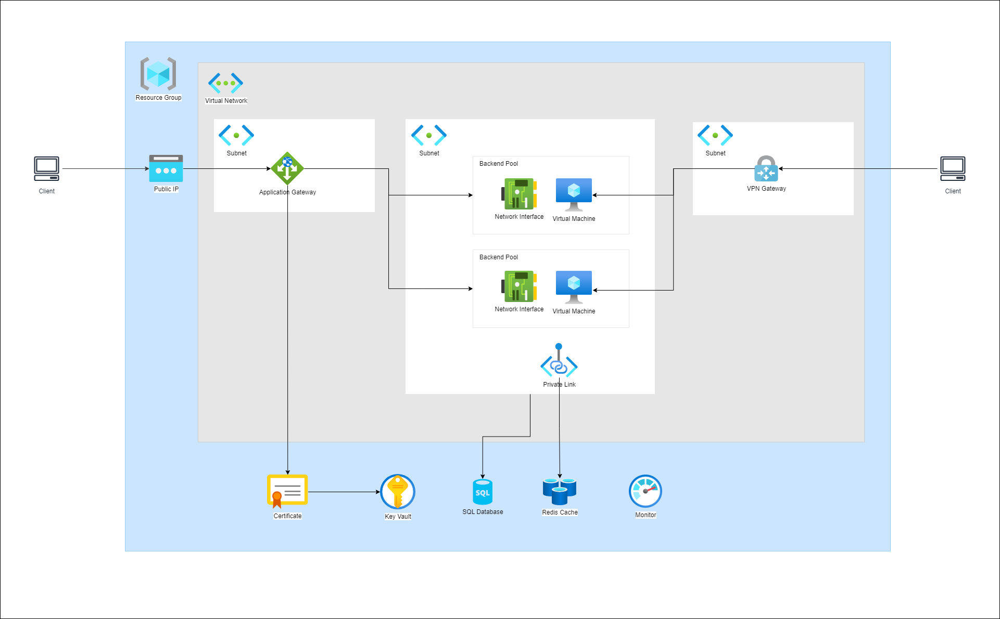

# POC: Azure Virtual Machines, Azure Application Gateway, Azure SQL, Azure Cache for Redis

This repository demonstrates a sample IIS application running in two [Azure Virtual Machines](https://azure.microsoft.com/en-us/products/virtual-machines/), behind a [Azure Application Gateway](https://azure.microsoft.com/en-us/products/application-gateway/) saving data to [Azure Sql Database](https://azure.microsoft.com/products/azure-sql/database), and sharing session state in [Azure Cache for Redis](https://azure.microsoft.com/services/cache).

## Features

- The application is hosted in Windows [Virtual Machines](https://azure.microsoft.com/en-us/products/virtual-machines/), an on-demand, scalable cloud computing Azure service with allocation of hardware, including CPU cores, memory, hard drives, network interfaces, and other devices to run a wide range of operating systems, applications, and workloads in the Azure cloud environment.  
- Data is stored in [Azure Sql Database](https://azure.microsoft.com/products/azure-sql/database), an intelligent, scalable, relational database service built for the cloud, that includes serverless compute.
- Session State is stored in [Azure Cache for Redis](https://azure.microsoft.com/services/cache), a fully managed, in-memory cache that enables high-performance and scalable architectures. Use it to create cloud or hybrid deployments that handle millions of requests per second at sub-millisecond latency—all with the configuration, security, and availability benefits of a managed service.
- Traffic to the virtual machines is managed by [Azure Application Gateway](https://azure.microsoft.com/en-us/products/application-gateway/), a web traffic (OSI layer 7) load balancer that can make routing decisions based on additional attributes of an HTTP request, for example URI path or host headers.
- Secure Access to the virtual machines is made through a point-to-site (P2S) [Azure VPN Gateway](https://azure.microsoft.com/en-us/products/vpn-gateway/), a service that uses a specific type of virtual network gateway to send encrypted traffic between an Azure virtual network and on-premises locations over the public Internet.

## Architecture

Below is the architecture deployed in this demonstration.



## Additional Azure Resources

- **[Azure resource groups](https://learn.microsoft.com/azure/azure-resource-manager/management/manage-resource-groups-portal)** are logical containers for Azure resources. You use a single resource group to structure everything related to this solution in the Azure portal.

- **[Azure KeyVault](https://azure.microsoft.com/en-us/products/key-vault/)** is a service that lets you store and safeguard cryptographic keys and other secrets used by cloud apps and services in the cloud. You can use FIPS validated HSMs, import or generate keys in minutes, and monitor and audit your key use with Azure logging and security operations.

- **[Azure Virtual Network](https://azure.microsoft.com/en-us/products/virtual-network/)** is a service that provides the fundamental building block for your private network in Azure. An instance of the service (a virtual network) enables many types of Azure resources to securely communicate with each other, the internet, and on-premises networks.

- **[Azure Private Link](https://azure.microsoft.com/en-us/products/private-link/)** enables access to Azure PaaS Services (for example, SQL Database) over a private endpoint in the virtual network.

- **[Azure Monitor](https://azure.microsoft.com/en-us/products/monitor)**  is a comprehensive monitoring solution for collecting, analyzing, and responding to monitoring data from your cloud and on-premises environments. 

## Benefits of this Architecture Sample
- **Scalability:** The architecture leverages Azure Virtual Machines, which are on-demand and scalable cloud computing resources. This allows the application to handle increased traffic and workload by dynamically scaling the number of virtual machines.

- **Reliability:** By using Azure Application Gateway, the architecture ensures high availability and fault tolerance by distributing traffic across multiple virtual machines. In case of a failure in one virtual machine, the application can still be accessed through other healthy virtual machines.

- **Performance:** Azure Cache for Redis is used to store session state, providing fast and low-latency access to session data. This improves the overall performance of the application by reducing the need to access the database for session-related operations.

- **Security:** Access to the virtual machines is secured through a point-to-site Azure VPN Gateway, which encrypts traffic between the Azure virtual network and on-premises locations over the public Internet. Additionally, Azure KeyVault is used to store and safeguard cryptographic keys and other secrets used by the application.

- **Flexibility:** The architecture allows for easy integration with other Azure services. For example, Azure Monitor can be used to collect and analyze monitoring data from the application, providing insights into its performance and health.

- **Cost-effectiveness:** By leveraging Azure Virtual Machines and Azure Application Gateway, the architecture optimizes resource allocation and reduces infrastructure costs. The use of serverless compute in Azure SQL Database further helps in cost optimization by automatically scaling resources based on demand.

- **Easy management:** The architecture utilizes Azure resource groups to logically organize and manage all the Azure resources related to the solution. This simplifies the management and administration of the application infrastructure.

- **Hybrid deployment:** The architecture supports hybrid deployments, allowing the application to seamlessly integrate with on-premises resources. This enables organizations to leverage their existing infrastructure while taking advantage of the scalability and flexibility of the cloud.

## Getting Started

The deployment process involves the following steps:
1. Provision the architecture using Bicep
1. Create application deployment package
1. Publish application deployment package

### Prerequisites

1. Local bash shell with Azure CLI or [Azure Cloud Shell](https://ms.portal.azure.com/#cloudshell/)
1. Azure Subscription. [Create one for free](https://azure.microsoft.com/free/).
1. Clone or fork of this repository.

### QuickStart

A bash script is included for quickly provisioning a fully functional environment in Azure. The script requires the following parameters:

```
-n: The deployment name.
-l: The region where resources will be deployed.
-c: A unique string that will ensure all resources provisioned are globally unique.
-u: The virtual machine administrator username
-p: The virtual machine administrator password
```
> **NOTE:** Please refer to the [Resource Name Rules](https://learn.microsoft.com/azure/azure-resource-manager/management/resource-name-rules#microsoftweb) to learn more about globally unique resources.

Follow the steps below to quickly deploy using the bash script:

1. Clone the repository to local machine.
    ```
    git clone https://github.com/achingono/poc-vm-appgateway-sharedsession.git
    ```
1. Switch to the cloned folder
    ```
    cd poc-vm-appgateway-sharedsession
    ```

1. Make the bash script executable
    ```
    chmod +x ./deploy.sh
    ```

1. Login to Azure and ensure the correct subscription is selected
    ```
    az login
    az account set --subscription <subscription id>
    az account show
    ```

1. Run the script and provide required parameters
    ```
    ./deploy.sh -n sharedsession -l eastus2 -c poc -u azureuser -p <secure password>
    ```
    In the above command, `sharedsession` is the name of the environment, and `poc` is the variant. This generates a resource group named `rg-sharedsession-eastus2-poc`.

## Cleanup

Clean up the deployment by deleting the single resource group that contains the entire infrastructure.

> **WARNING:** This will delete ALL the resources inside the resource group.

1. Make the bash script executable
    ```
    chmod +x ./destroy.sh
    ```

2. Login to Azure and ensure the correct subscription is selected
    ```
    az login
    az account set --subscription <subscription id>
    az account show
    ```

3. Run the script and provide required parameters
    ```
    ./destroy.sh -n sharedsession -l eastus2 -c poc
    ```